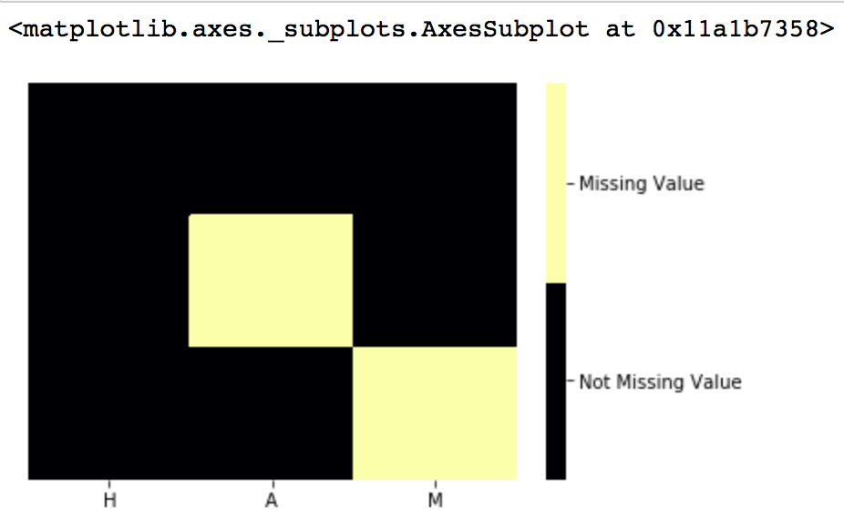
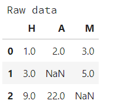
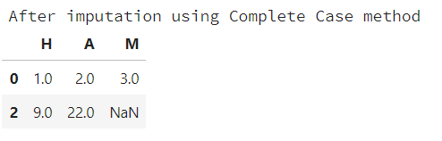
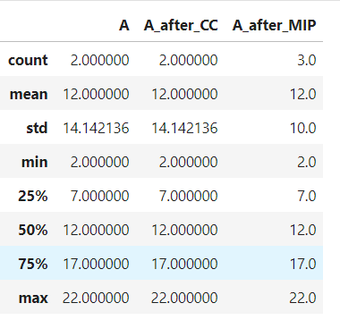

# HAM_Python

Handle All Missing (Values) 

*Feb 8th, 2018*

## Project contributors:

1. [Duong Vu](https://github.com/DuongVu39)
2. [Jordan Dubchak](https://github.com/jdubchak)
3. [Linsey Yao](https://github.com/yllz)

## To install please execute the following from the command line:

```
pip install git+https://github.com/UBC-MDS/HAM_Python.git
```

## Introduction

Our package intends to explore the pattern of missing values in users' dataset and also imputes the missing values using several methods. 

We decided to make this project because we have not found any package that handle both tasks in either R or Python. In R, we found [Amelia](https://cran.r-project.org/web/packages/Amelia/Amelia.pdf) and [vis_dat](https://cran.r-project.org/web/packages/visdat/index.html) package that only visualize the missing data and in Python we found [fancyimpute](https://pypi.python.org/pypi/fancyimpute) that deals with missing value but does not have any visualization and [missingno](https://github.com/ResidentMario/missingno) handle the visualization only. We thought this would be better package for users who do not have much experience in data wrangling.

## Dependencies

`Python 3`

`matplotlib.pyplot`

`numpy`

`pandas`

`seaborn`

`warnings`

## Functions

Currently, our package only handles continuous features.

- `todf(data_obj, col_names=None)`: convert a matrix to a data frame or returns the original input data frame
    - Input:
      - `data_obj`: a data frame or a numerical matrix
      - `col_names`: a list of column names (default is None)
    - Output: If the `col_names` is None, then returns a data frame with small letters ('a', 'b', ...) being column names. Otherwise returns a data frame with user-specified column names.

- Exploratory Function: use matplotlib and seaborn to plot patterns or proportions of missing values in the dataset:
  - `vis_missing()`: creates a heatmap that visualizes the missing values in the data set
    - Input: 
      - dataset
      - seaborn color scheme, default is "inferno"
      - missing value character (np.NaN, np.NAN, np.nan," ", "", "?")
    - Output: a heatmap that visualizes the missing values in the dataset

- `impute_missing(dfm, col, method, missing_val_char)`: Impute the missing value in a specified column of a data frame or a numerical matrix
    - Input:
      - `dfm`: a data frame or a numerical matrix with missing values
      - `col`: a column name (string)
      - `method`: a method name ("CC", "MIP", "DIP")
      - `missing_val_char`: missing value characters (np.nan, np.NaN, np.NAN, "", "?")
    - Output: a data frame with no missing values in the specified column

- `compare_model()`: Compare summary statistics between various imputation methods
    - Input: 

      - `df` (ndarray) -- the original dataset with missing values that needs to be imputed
      - `feature` (str) -- name of a specified feature from the original dataset 

      ​        containing missing values that need to be imputed

      - `methods` (str or list)-- the methods that users want to compare (default: ["CC","IMP"])

      ​        Supporting methods are: 
      ​            CC 	- Complete Case
      ​            MIP     - Imputation with mean value
      ​            DIP     - Imputation with median value

      - `missing_val_char` (str or float) -- missing value types. 

      ​        Supporting types are:
      ​            NaN - Not a Number (np.nan, np.NaN, np.NAN)
      ​            ""     - Blank
      ​            "?"   - Question mark

    - Output: a summary table

    - Call the above function for several methods

    - Compare the summary statistics of what being imputed in the dataset using several available methods

## Typical Usage

- Import the package

```
import numpy as np
import pandas as pd
from ham.ham import todf, impute_missing, compare_model, vis_missing
# (from HAM_Python.ham import ham)

```

- `vis_missing()`

``` 
raw_data = np.matrix([[1, 2, 3], [3, np.nan, 5], [9, 22, np.nan]])
vis_missing(raw_data, missing_val_char = np.nan)
```



- `impute_missing()`

``` 
df = impute_missing(raw_data, 'A', "CC", np.NaN)

print(df)
```

 

- `compare_model()`

``````
compare_model(raw_data, 'A', ("CC","MIP"), np.nan)
``````




## HAM in R

This package is also available in [R](https://github.com/UBC-MDS/hamr)
